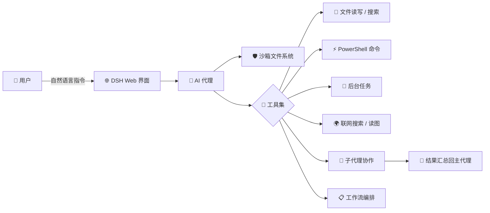

> 这篇文章本身就是由运行在 DSH 里的 AI 代理协助完成的——从连接 GitHub、搭建开发环境，到最终写入这篇稿件，全程只靠对话驱动。

## 🌟 什么是 DSH

**DSH（DeepSeek Harness）** 是一个面向开发者的 AI 代理运行环境。它把一个大语言模型驱动的编码代理装进一个受控的「工作台」里：代理可以读写文件、执行命令、联网搜索、派发子代理、编排大规模任务，而人类只需要通过一个 Web 界面用自然语言下达指令。

简单来说，它解决了一个核心问题：**让 AI 不只是一个聊天窗口，而是一个真正能干活的开发者。**

## 🛡️ 沙箱文件系统：安全可控

DSH 对文件操作实行**分级权限策略**，越权操作会被明确拒绝，而不是悄悄放行：

| 权限模式 | 能力 | 适用场景 |
| --- | --- | --- |
| `read-only`（只读） | 只能读取文件 | 审查代码、只读分析 |
| `workspace-write`（工作区可写） | 可修改工作区内的文件 | 日常开发 |
| `danger-full-access`（完全访问） | 不受限制的文件操作 | 安装依赖、运行服务等特殊操作 |

被拒绝的操作会返回明确的沙箱错误标记（如 `[sandbox: file access denied]`），代理不能绕过，只能申请更高级别权限或换一种不越权的方式——这让「AI 乱动文件」的风险变得可控。

## 🧰 丰富的工具集

### 文件与代码操作

- **read / write / edit**：带行号读取、整文件写入、精准文本替换，配合 `offset` / `limit` 处理大文件
- **glob / grep**：按路径模式查找文件、按正则搜索代码内容，替代 shell 的 `find` / `grep`

### 命令执行与后台任务

- **pwsh**：直接执行 PowerShell 命令，并可指定工作目录、超时、后台运行
- **后台任务（job）**：长时间任务（如 `pnpm install`、启动开发服务器）扔到后台跑，任务完成时主动通知代理，无需轮询；随时可查看输出或强制停止
- 环境内置文档化的沙箱边界（例如禁止捕获子进程管道的 `EPERM`），代理遇到边界会换方案或申请提权，而不是瞎猜

### 联网与多媒体

- **web_search**：实时联网搜索，返回来源链接，方便核对信息
- **read_image**：直接读取图片内容（PNG / JPEG / WebP / GIF）
- **ask_user_question**：结构化提问，让用户在关键决策点做选择

## 👥 子代理与并行协作

单个代理的上下文有限，DSH 用**子代理**解决了规模化问题：

- **subagent**：把独立任务（调研、审查、实现）打包给全新上下文的子代理，默认**后台并行**运行
- **subagent_fork**：继承当前对话上下文的子代理，适合做基于已有分析的延续工作
- **send_message / interrupt_agent**：给子代理追加任务、或中途叫停
- 子代理完成后会主动通知主代理，主代理可以继续向它派活

## 📋 工作流编排：大规模任务利器

当任务需要**成百上千个独立单元**并行处理时（比如全仓库审计、批量迁移、多角度验证），可以用 `workflow` 工具写一段 JavaScript 编排脚本：

- `pipeline()`：让每个条目依次经过多个处理阶段，互不阻塞
- `parallel()`：真正并发执行一组任务并汇总
- `phase()` / `log()`：划分进度阶段、输出进度
- 子代理按 JSON Schema 返回**结构化结果**，脚本统一收口

## 🔄 Ralph 循环与长期目标

- **Ralph 循环**：面向不可变目标的多轮「新鲜代理」迭代——每轮开启一个无对话记忆的子代理，以共享工作区为长期记忆，适合反复试错收敛的任务
- **Goal 目标工具**：把长跑目标持久化到会话中，跨轮次追踪进度，支持暂停 / 恢复 / 完成 / 阻塞上报，代理每轮结束都能续上进度

## 📝 计划模式

面对复杂任务，DSH 支持先进入**计划模式**：代理把完整方案呈现给用户审阅，用户批准后才动手执行——而不是 AI 闷头就干。

## 🚀 实战体验：用它跑起这个博客

说一千道一万，不如看一次真实流程。就在写这篇文章之前，DSH 里的代理完成了一整套操作：

1. **连接 GitHub**：检测到本机 PowerShell / curl 的 TLS 凭证问题，改用 git 协议验证连通性，并成功 clone 了本仓库
2. **配置写权限**：引导生成 Personal Access Token，绕过沙箱里无法运行的凭据管理器，把 token 嵌入 remote URL，用 `push --dry-run` 验证了推送权限
3. **搭建开发环境**：发现 PowerShell 执行策略拦截 `pnpm.ps1`，改用 `pnpm.cmd`；用 corepack 版本不匹配时果断换 npm 全局安装
4. **安装依赖**：1131 个包下载完成后，postinstall 被沙箱管道限制拦截（`spawn EPERM`）——申请提权后 5 秒重跑成功
5. **启动预览**：后台启动 `astro dev`，验证首页 HTTP 200、标题「itong - 798」正常渲染

整个过程中，代理遇到的环境坑（执行策略、沙箱边界、凭据问题）都是**边做边诊断、边修边继续**，没有一步需要人手动干预命令行。

> [!TIP]
> 这篇文章里的每一个功能点，都可以在这个网站的开发流程中找到对应实例：后台任务跑依赖安装、子代理并行调研、沙箱提权安装 esbuild……

## 🎯 适用场景

- **日常开发**：改代码、跑测试、提交推送，全对话驱动
- **项目初始化**：clone 仓库、装依赖、起服务、验证效果
- **大规模重构 / 审计**：workflow 编排上百个子代理并行处理
- **研究调研**：联网搜索 + 多来源交叉验证
- **运维排障**：沙箱边界内安全执行命令，遇坑即修

## 💡 总结

DSH 的核心理念是：**把 AI 的「思考」和「动手」放在同一个受控环境里**。沙箱保证安全，工具集保证能力，子代理与工作流保证规模，后台任务与目标追踪保证长跑不迷路。

而作为使用者，你只需要会打字——剩下的，交给它。

---

*本文由运行在 DSH 中的 AI 代理协助撰写，部署于 [hudong798/Firefly](https://github.com/hudong798/Firefly)。*

::github{repo="hudong798/Firefly"}
